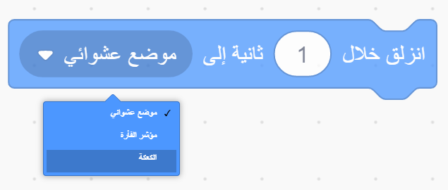

المقطع البرمجي `انزلق`{: class = "block3motion"} في Scratch يستخدم لتحريك كائن عبر المنصة.

الكائن يمكن ان `ينزلق`{: فئة = "block3motion"} إلى نقطة محددة (إحداثيات)، و `موضع عشوائي`{: فئة = "block3motion"}، و `مؤشر الفارة`{: فئة = "block3motion"}، أو إلى كائن آخر.

ضع الكائنات المتحركة في نقاط البداية ، ثم حدد الكائن الذي سينزلق:


اسحب المقطع البرمجي `انزلق(1) ثانية س: ص:`{: class = "block3motion"} في منطقة المقاطع البرمجية ولكن لا تقم بإرفاقها بأي مقطع برمجي أخر. يحتوي هذا المقطع البرمجي على إحداثيات نقطة البداية وسيتم استخدامها لاحقًا لإعادة الكائن:

```blocks3
glide (1) secs to x: (-150) y:(-80) // your numbers will be different
```

اسحب المقطع البرمجي `انزلاق (1) ثانية إلى (الموضع العشوائي)`{: class = "block3motion"} في منطقة البرمجة وأضفه إلى المقطع البرمجي الخاص بك عند النقطة التي تريد أن يتحرك اليها الكائن.

انقر على القائمة المنسدلة واختر اسم الكائن الذي تريد `ينزلق`{: فئة = "block3motion"} نحوه:



```blocks3
glide (1) secs to (Cake v)
```


وأخيرا، اسحب المقطع البرمجي `انزلق(1) ثانية إلى س: ص:`{: فئة = "block3motion"} ، والذي هو موجود في مساحة البرمجة، الى المقطع البرمجي `انزلق`الخاص بك{: فئة = "block3motion"} للعودة الى البداية:

```blocks3
glide (1) secs to (Cake v)
glide (1) secs to x: (-150) y:(-80)
```
