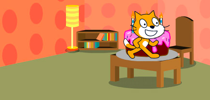

Mae'r blociau `llithro`{:class="block3motion"} yn gallu cael eu defnyddio i symud corlun ar draws y Llwyfan.

Gall corlun `lithro`{:class="block3motion"} i bwynt penodol (cyfesurynnau), `safle ar hap`{:class="block3motion"}, `pwyntydd llygoden`{:class="block3motion"}, neu i gorlun arall.

Lleola dy gorluniau yn eu mannau cychwyn wedyn dewis y corlun sy'n mynd i lithro:


Llusga floc `llithro (1) eiliad i x: y:`{:class="block3motion"} i ardal y Cod ond paid â'i uno i unrhyw flociau eraill eto. Mae gan y bloc hwn gyfesurynnau'r man cychwyn a bydd yn cael ei ddefnyddio yn nes ymlaen i ddychwelyd y corlun:

```blocks3
glide (1) secs to x: (-150) y:(-80) // bydd dy rifau di yn wahanol
```

Llusga floc `llithro (1) eiliad i (safle ar hap v)`{:class="block3motion"} i mewn i ardal y cod a'i ychwanegu at dy god di ar y pwynt rwyt ti am i'r corlun symud iddo.

Clicia ar y gwymplen a dewis enw'r corlun rwyt ti am `lithro`{:class="block3motion"} tuag ato:


```blocks3
glide (1) secs to (Cake v)
```



I orffen, llusga'r bloc `llithro (1) eiliad i x: y:`{:class="block3motion"} block, sydd yn ardal y Cod yn barod, i dy sgript i `lithro`{:class="block3motion"} yn ôl i'r dechrau:

```blocks3
glide (1) secs to (Cake v)
glide (1) secs to x: (-150) y:(-80)
```
