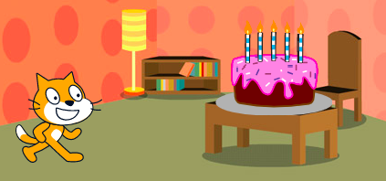
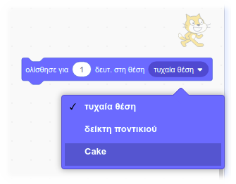

Τα μπλοκ `ολίσθησε`{:class="block3motion"} στο Scratch μπορούν να χρησιμοποιηθούν για τη μετακίνηση ενός αντικειμένου στη Σκηνή.

Ένα αντικείμενο μπορεί να `ολισθήσει`{:class="block3motion"} προς ένα συγκεκριμένο σημείο (συντεταγμένες), προς μια `τυχαία θέση`{:class="block3motion"}, προς τον `δείκτη ποντικιού`{:class="block3motion"}, ή προς άλλο αντικείμενο.

Τοποθέτησε τα αντικείμενά σου στα σημεία εκκίνησής τους και στη συνέχεια επίλεξε το αντικείμενο που πρόκειται να ολισθήσει:



Σύρε ένα μπλοκ `ολίσθησε (1) δευτ. σε x: y:`{:class="block3motion"} στην περιοχή Κώδικα αλλά μην το προσαρτήσεις σε κανένα άλλο μπλοκ ακόμα. Αυτό το μπλοκ έχει τις συντεταγμένες του σημείου εκκίνησης και θα χρησιμοποιηθεί αργότερα για την επιστροφή του αντικειμένου:

```blocks3
glide (1) secs to x: (-150) y:(-80) // οι αριθμοί σου θα είναι διαφορετικοί
```

Σύρε ένα μπλοκ `ολίσθησε (1) δευτ. σε (τυχαία θέση v)`{:class="block3motion"} στην περιοχή Κώδικα και πρόσθεσε το στον κώδικά σου στο σημείο που θέλεις να μετακινηθεί το αντικείμενο.

Κάνε κλικ στο αναπτυσσόμενο μενού και επίλεξε το όνομα του αντικειμένου που θέλεις να `ολισθήσει`{:class="block3motion"} προς:



```blocks3
glide (1) secs to (Cake v)
```


Τέλος, σύρε το μπλοκ `ολίσθησε (1) δευτ. σε x: y:`{:class="block3motion"}, που βρίσκεται ήδη στην περιοχή του Κώδικα, στο script σου για `ολίσθηση`{:class="block3motion"} πίσω στην αρχή:

```blocks3
glide (1) secs to (Cake v)
glide (1) secs to x: (-150) y:(-80)
```

