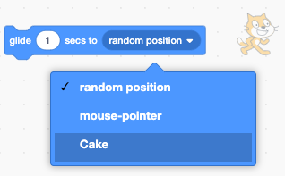
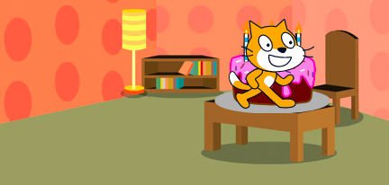

The `glide`{:class="block3motion"} blocks in Scratch can be used to move a sprite across the Stage.

A sprite can `glide`{:class="block3motion"} to a specific point (coordinates), a `random postion`{:class="block3motion"}, the `mouse pointer`{:class="block3motion"}, or to another sprite.

Positon your sprites in their starting points then select the sprite that is going to glide:


Drag a `glide (1) secs to x: y:`{:class="block3motion"} block into the Code area but don't attach it to any other blocks yet. This block has the coordinates of the starting point and will be used later to make the sprite return:

```blocks3
glide (1) secs to x: (-150) y:(-80) // your numbers will be different
```

Drag a `glide (1) secs to (random position v)`{:class="block3motion"} block into the Code area and add it to your code at the point you want the sprite to move.

Click on the dropdown menu and select the name of the sprite you want to `glide`{:class="block3motion"} towards:



```blocks3
glide (1) secs to (Cake v)
```



Finally, drag the `glide (1) secs to x: y:`{:class="block3motion"} block, that is already in the Code area, to your script to `glide`{:class="block3motion"} back to the start:

```blocks3
glide (1) secs to (Cake v)
glide (1) secs to x: (-150) y:(-80)
```
