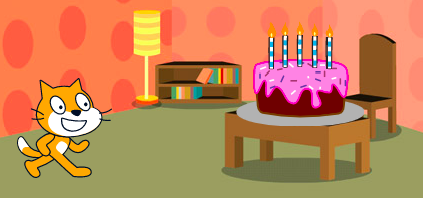

Los bloques `desplazar`{:class="block3motion"} en Scratch se pueden usar para mover un objeto por el Escenario.

Un objeto se puede `desplazar`{:class="block3motion"} a un punto específico (coordenadas), a una `posición aleatoria`{:class="block3motion"}, a el `puntero del ratón`{:class="block3motion"}, o hacia otro objeto.

Coloca tus objetos en su posición de inicio y luego selecciona el objeto que se va a desplazarse:



Arrastra un bloque `desplazar en (1) segs a x: y:`{:class="block3motion"} al Área de código, pero no lo adjuntes a ningún otro bloque todavía. Este bloque tiene las coordenadas de la posición de inicio y se usará más adelante para hacer que el objeto regrese:

```blocks3
glide (1) secs to x: (-150) y:(-80) // your numbers will be different
```

Arrastra un bloque `desplazar en (1) segs a (posición aleatoria v)`{:class="block3motion"} hacía el Área de código y agrégalo a tu código en el punto en el que quieras que se mueva el objeto.

Haz clic en el menú desplegable y selecciona el nombre del objeto hacia el que te quieres `desplazar`{:class="block3motion"}:


```blocks3
glide (1) secs to (Cake v)
```


Finalmente, arrastra el bloque `desplazar en (1) segs a x: y:`{:class="block3motion"}, que ya está en el Área de código, a tu script para poder `desplazar`{:class="block3motion"} de regreso al inicio:

```blocks3
glide (1) secs to (Cake v)
glide (1) secs to x: (-150) y:(-80)
```
