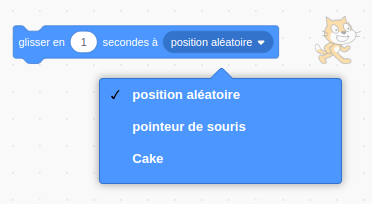

Les blocs `glisser`{:class="block3motion"} dans Scratch peuvent être utilisés pour déplacer un sprite sur la scène.

Un sprite peut `glisser`{:class="block3motion"} vers un point spécifique (coordonnées), une `position aléatoire`{:class="block3motion"}, le `pointeur de la souris`{:class="block3motion"}, ou vers un autre sprite.

Positionne tes sprites à leurs points de départ puis sélectionne le sprite qui va glisser :


Fais glisser un bloc `glisser en (1) secondes à x: y:`{:class="block3motion"} dans la zone Code mais ne l'attache pas encore à d'autres blocs. Ce bloc a les coordonnées du point de départ et sera utilisé plus tard pour faire revenir le sprite :

```blocks3
glide (1) secs to x: (-150) y:(-80) // tes nombres seront différents
```

Fais glisser un bloc `glisser en (1) secondes à (position aléatoire v)`{:class="block3motion"} dans la zone Code et ajoute-le à ton code à l'endroit où tu souhaites que le sprite se déplace.

Clique sur le menu déroulant et sélectionne le nom du sprite que tu souhaites `glisser`{:class="block3motion"} vers :



```blocks3
glide (1) secs to (Cake v)
```


Enfin, fais glisser le bloc `glisser en (1) secondes à x: y:`{:class="block3motion"}, qui se trouve déjà dans la zone Code, vers ton script pour `glisser`{:class="block3motion"} de retour au début :

```blocks3
glide (1) secs to (Cake v)
glide (1) secs to x: (-150) y:(-80)
```
