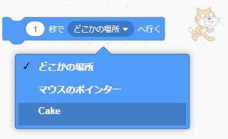

Scratchの`行く/座標を変える`{:class="block3motion"}ブロックを使用すると、ステージ上でスプライトを移動できます。

スプライトは、特定の位置（座標）、`どこかの場所`{:class="block3motion"}、 `マウスのポインター`{:class="block3motion"}、または別のスプライトに向かって`なめらかに移動`{:class="block3motion"}できます。

スプライトをそれぞれのスタート地点に置いて、移動させるスプライトを選択します。


`(1)秒でx座標を...に、y座標を...に変える`{:class="block3motion"}ブロックをコード領域にドラッグします。このとき、他のブロックにはまだ接続しないでください。 このブロックにはスタート地点の座標が保持されていて、後でスプライトを戻すために使われます。

```blocks3
glide (1) secs to x: (-150) y:(-80) // x座標、y座標の数値は違っていてもいいです
```

`(1)秒で(どこかの場所 v)へ行く`{:class="block3motion"}ブロックをコード領域にドラッグし、コードの中でスプライトを移動させたい所に追加します。

ドロップダウンメニューをクリックし、`行く`{:class="block3motion"}先のスプライトの名前を選択します。



```blocks3
glide (1) secs to (Cake v)
```


最後に、先ほどコード領域に置いた`(1)秒でx座標を...に、y座標を...に変える`{:class="block3motion"}ブロックをスクリプトにドラッグして、スタート地点に`戻る`{:class="block3motion"}ようにします。

```blocks3
glide (1) secs to (Cake v)
glide (1) secs to x: (-150) y:(-80)
```
