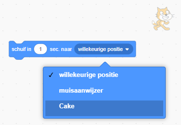

De `schuif`{:class="block3motion"} blokken in Scratch kunnen worden gebruikt om een sprite over het speelveld te laten bewegen.

Een sprite kan `schuiven`{:class="block3motion"} naar een specifiek punt (coördinaten), een `willekeurige positie`{:class="block3motion"}, de `muisaanwijzer`{:class="block3motion"}, of naar een andere sprite.

Plaats je sprites in hun startposities en selecteer vervolgens de sprite die gaat glijden:


Sleep een `schuif in (1) sec naar x: y:`{:class="block3motion"} blok naar het codegebied, maar bevestig het nog niet aan andere blokken. Dit blok heeft de coördinaten van het startpunt en zal later worden gebruikt om de sprite terug te laten keren:

```blocks3
glide (1) secs to x: (-150) y:(-80) // your numbers will be different
```

Sleep een `schuif in (1) sec naar (willekeurige positie v)`{:class="block3motion"} blok in het codegebied en voeg het toe aan je code op het punt waar je de sprite wilt laten bewegen.

Klik op het vervolgkeuzemenu en selecteer de naam van de sprite waarnaar je wilt `glijden`{:class="block3motion"}:



```blocks3
glide (1) secs to (Cake v)
```


Sleep ten slotte het `schuif in (1) sec naar x: y:`{:class="block3motion"} blok, dat al in het codegebied staat, naar je script om terug naar het begin `te schuiven`{:class="block3motion"}:

```blocks3
glide (1) secs to (Cake v)
glide (1) secs to x: (-150) y:(-80)
```
