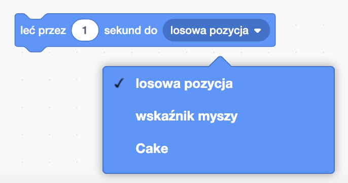

Bloki `leć`{:class="block3motion"} w Scratchu mogą być używane do przemieszczania duszka po Scenie.

Duszek może za pomocą `leć`{:class="block3motion"} przemieścić się do konkretnego punktu, `losowej pozycji`{:class="block3motion"}, `wskaźnika myszy`{:class="block3motion"}, lub innego duszka.

Ustaw swoje duszki w ich pozycjach początkowych, a następnie wybierz duszka który ma lecieć:


Przeciągnij blok `leć (1) sekunde do x: y:`{:class="block3motion"} do obszaru skryptu, ale nie przyczepiaj go jeszcze do żadnego innego bloku. Ten blok ma współrzędne punktu początkowego i będzie poźniej wykorzystany, aby duszek wrócił na swoje miejsce:

```blocks3
glide (1) secs to x: (-150) y:(-80) // twoje liczby będą inne
```

Przeciągnij blok `leć (1) sekunde do (losowej pozycji v):`{:class="block3motion"} do obszaru skryptu i dodaj do swojego kodu w miejscu w którym duszek ma się ruszać.

Naciśnij listę rozwijaną i wybierz nazwę duszka który ma `lecieć`{:class="block3motion"} w kierunku:



```blocks3
glide (1) secs to (Cake v)
```


Na końcu przeciągnij znajdujący się w obszarze skryptu blok `leć (1) sekunde do x: y:`{:class="block3motion"}, aby wykonać polecenie `leć`{:class="block3motion"} z powrotem do punktu początkowego:

```blocks3
glide (1) secs to (Cake v)
glide (1) secs to x: (-150) y:(-80)
```
