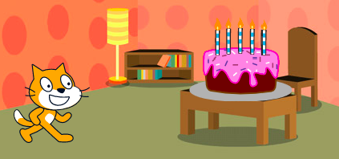
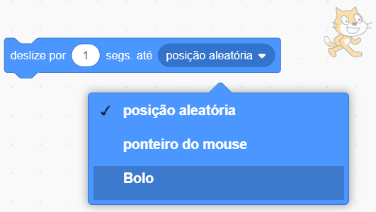

O bloco `deslize`{:class="block3motion"} no Scratch pode ser usado para mover um ator pelo Palco.

Um ator pode `deslizar`{:class="block3motion"} para um ponto específico (coordenadas), uma `posição aleatória`{:class="block3motion"}, o `ponteiro do mouse`{:class="block3motion"}, ou para um outro ator.

Posicione seus atores em seus pontos de partida e selecione o ator que vai deslizar:



Arraste um bloco `deslize por (1) segs. até x: y:`{:class="block3motion"} para a área de Código, mas não o encaixe em nenhum outro bloco por enquanto. Este bloco tem as coordenadas do ponto inicial e será usado depois para fazer o ator voltar:

```blocks3
glide (1) secs to x: (-150) y:(-80) // seus números serão diferentes
```

Arraste um bloco `deslize por (1) segs. até (posição aleatória v)`{:class="block3motion"} para a área de Código e o encaixe no ponto em que você deseja que seu ator se mova.

Clique na lista de opções e selecione o nome do ator para o qual você deseja que seu ator `deslize`{:class="block3motion"}:



```blocks3
glide (1) secs to (Cake v)
```


Por fim, arraste para o seu programa o bloco `deslize por (1) segs. para x: y:`{:class="block3motion"}, que já está na área de Código, para que `deslize`{:class="block3motion"} de volta ao início:

```blocks3
glide (1) secs to (Cake v)
glide (1) secs to x: (-150) y:(-80)
```
