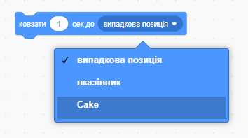
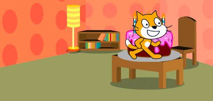

Блоки `ковзати`{:class="block3motion"} у Scratch можна використовувати для переміщення спрайта по Сцені.

Спрайт може `ковзати`{:class="block3motion"} до конкретної точки (координати), до `випадкова позиція`{:class="block3motion"}, до `вказівник`{:class="block3motion"}, або до іншого спрайта.

Розташуй спрайти у початкових точках, а потім вибери спрайт, який буде ковзати:


Перетягни блок `ковзати (1) сек до x: y:`{:class="block3motion"} в Область коду, але поки що не приєднуй його до інших блоків. Цей блок має координати початкової точки та буде використовуватися надалі для повернення спрайта:

```blocks3
glide (1) secs to x: (-150) y:(-80) // your numbers will be different
```

Перетягни блок `ковзати (1) сек до (випадкова позиція v)`{:class="block3motion"} в Область коду і додай його до свого коду в точці, в яку повинен рухатися спрайт.

Натисни на розкривне меню і вибери ім'я спрайта, якому ти хочеш `ковзати`{:class="block3motion"}, назустріч:



```blocks3
glide (1) secs to (Cake v)
```



Наостанок, перетягни блок `ковзати (1) сек до x: y:`{:class="block3motion"}, який вже знаходиться в Області коду, до свого скрипту `ковзати `{:class="block3motion"}, щоб повернутися у початкову точку:

```blocks3
glide (1) secs to (Cake v)
glide (1) secs to x: (-150) y:(-80)
```
